# Diagrama de Componentes — BloomTrade Backend (C4 Nivel 3)

**Fuente:** `ARCHITECTURE.md` §3 (módulos), §4 (componentes internos), §5 (interfaces entre módulos).
**Última actualización:** 2026-05-25 — post-cierre Sprint 2.

Descompone el contenedor `Backend Monolito` del [Nivel 2](c4-container.md) en sus 9 módulos internos y las interfaces Java que los conectan. Todas las llamadas entre componentes son **invocaciones directas en el mismo JVM** — no hay red, no hay serialización, las llamadas participan en la transacción del thread invocador (`ARCHITECTURE.md` §5).

---

## Diagrama

```mermaid
C4Component
  title BloomTrade Backend — Componentes (C4 Nivel 3)

  Container(spa, "Frontend SPA", "React 18", "Llama /api/v1/*")

  Container_Boundary(api, "Backend Monolito (Spring Boot)") {
    Component(auth, "AuthService", "co.edu.unbosque.bloomtrade.auth", "MFAValidator, LoginAttemptTracker, JWT, sesiones temporales.")
    Component(trading, "TradingService", "...trading", "PriorityQueue, ThreadPool, OrderOrchestrator. Recibe quote y placeOrder.")
    Component(portfolio, "PortfolioService", "...portfolio", "BalanceInitializer. Posiciones, saldo, historial.")
    Component(notif, "NotificationService", "...notification", "ThreadPool para despacho multicanal (email/SMS/WhatsApp).")
    Component(dash, "DashboardService", "...dashboard", "PriceCache (Redis) de los 25 activos.")
    Component(adminm, "AdminService", "...admin", "ConfigurationManager, CommissionManager, MarketScheduleManager.")
    Component(audit, "AuditService", "...audit", "AuditLogger — eventos inmutables.")
    Component(integ, "IntegrationService", "...integration", "AlpacaAdapter, MarketDataAdapter, StripeAdapter, TwilioAdapter (+ Resilience4j).")
    Component(mon, "MonitoringService", "...monitoring", "HealthMonitor + Spring Actuator.")
  }

  ContainerDb(pg, "PostgreSQL", "schemas app/config/audit")
  ContainerDb(redis, "Redis", "PriceCache + sesiones MFA + JWT blacklist")
  Container(elk, "ElasticSearch", "Logs de auditoría")
  System_Ext(alpaca, "Alpaca Markets", "Trading + data")
  System_Ext(polygon, "Polygon.io", "Market data")
  System_Ext(stripe, "Stripe", "Pagos")
  System_Ext(twilio, "Twilio", "SMS/WhatsApp")
  Container(mailhog, "MailHog", "SMTP dev")

  Rel(spa, trading, "POST /api/v1/orders, /orders/quote", "HTTPS")
  Rel(spa, auth, "POST /auth/login, /auth/mfa/verify", "HTTPS")
  Rel(spa, portfolio, "GET /portfolio/*", "HTTPS")
  Rel(spa, dash, "GET /dashboard/prices", "HTTPS")

  Rel(trading, auth, "IAuthentication (validar JWT)")
  Rel(portfolio, auth, "IAuthentication")
  Rel(auth, portfolio, "IBalanceInitializer (registro)")

  Rel(trading, portfolio, "IPortfolio (posiciones, balance)")
  Rel(trading, adminm, "IMarketSchedule, ICommission")
  Rel(trading, integ, "IOrderExecution (AlpacaAdapter)")
  Rel(trading, notif, "INotification (post-commit)")
  Rel(trading, audit, "IAudit")

  Rel(dash, integ, "IMarketData")
  Rel(portfolio, integ, "IPayment (Stripe)")

  Rel(auth, notif, "INotification (OTP, bienvenida)")
  Rel(auth, audit, "IAudit")
  Rel(portfolio, audit, "IAudit")
  Rel(adminm, audit, "IAudit")
  Rel(adminm, notif, "INotification")

  Rel(integ, alpaca, "AlpacaAdapter (+ Retry)", "HTTPS")
  Rel(integ, polygon, "MarketDataAdapter", "HTTPS")
  Rel(integ, stripe, "StripeAdapter", "HTTPS")
  Rel(integ, twilio, "TwilioAdapter", "HTTPS")

  Rel(dash, redis, "PriceCache", "TCP")
  Rel(auth, redis, "Sesiones temporales MFA, JWT blacklist", "TCP")
  Rel(audit, elk, "AuditLogger", "HTTP")
  Rel(notif, mailhog, "Spring Mail (SMTP directo, ARCH §8)", "SMTP")

  UpdateLayoutConfig($c4ShapeInRow="3", $c4BoundaryInRow="1")
```

> **Nota — acceso a PostgreSQL:** todos los módulos del dominio (`AuthService`, `TradingService`, `PortfolioService`, `AdminService`, `AuditService`) leen y escriben en PostgreSQL vía JPA. Por densidad visual no se dibuja una flecha por módulo: la dependencia es transversal. Los schemas `app/config/audit` separan los dominios según `ARCHITECTURE.md` §7.

---

## Catálogo de interfaces (extracto de `ARCHITECTURE.md` §5)

| Expuesta por | Interfaz | Consumida por | Propósito |
|---|---|---|---|
| AuthService | `IAuthentication` | TradingService, PortfolioService | Validar JWT y resolver `AuthenticatedUser` |
| AuditService | `IAudit` | Auth, Trading, Portfolio, Admin | Emitir eventos inmutables |
| TradingService | `IOrder` | WebApp (REST) | Crear y consultar órdenes |
| PortfolioService | `IPortfolio` | TradingService | Posiciones y balance del usuario |
| PortfolioService | `IBalanceInitializer` | AuthService.RegisterService | Crear saldo demo USD 10,000 al registrarse |
| NotificationService | `INotification` | Trading, Auth, Admin | Despacho multicanal |
| AdminService | `IMarketSchedule` | TradingService | Validar horario del mercado |
| AdminService | `ICommission` | TradingService | Calcular comisión |
| IntegrationService | `IOrderExecution` | TradingService | Submit a Alpaca |
| IntegrationService | `IPayment` | PortfolioService | Suscripción Stripe |
| IntegrationService | `IMarketData` | DashboardService | Snapshots de precio |
| MonitoringService | `IHealthStatus` | Spring Actuator | Endpoint `/actuator/health` |

## Tácticas materializadas a nivel de componente

(extracto de `ARCHITECTURE.md` §6.1)

| Módulo | Componente | Táctica | Atributo |
|---|---|---|---|
| AuthService | MFAValidator | TAC-S1 — Autenticar actores | Seguridad |
| AuthService | LoginAttemptTracker | TAC-S3 — Revocar acceso | Seguridad |
| TradingService | PriorityQueue | TAC-R3 — Priorizar eventos | Rendimiento |
| TradingService | OrderOrchestrator | TAC-I1 — Orquestar | Interoperabilidad |
| DashboardService | PriceCache | TAC-R2 — Caché | Rendimiento |
| AdminService | ConfigurationManager | TAC-M2 — Diferir el enlace | Modificabilidad |
| IntegrationService | RetryPolicy (Resilience4j) | TAC-D2 — Retry | Disponibilidad |
| IntegrationService | *Adapter | TAC-M1 / TAC-I2 — Intermediario + Adaptar interfaz | Modificabilidad + Interoperabilidad |
| AuditService | AuditLogger | TAC-S4 — Mantener registro | Seguridad |
| MonitoringService | HealthMonitor | TAC-D1 — Heartbeat | Disponibilidad |

## Reglas que este diagrama hace cumplir

1. Toda invocación entre módulos pasa por una **interfaz Java** (bean Spring), nunca por reflection ni por estado compartido (`ARCHITECTURE.md` §5).
2. Ningún módulo de dominio llama directamente a una API externa HTTP: siempre vía `IntegrationService` (excepción documentada: SMTP vía Spring Mail nativo — `ARCHITECTURE.md` §8).
3. La cadena post-confirmación de Alpaca (portafolio → notificación → auditoría) la ordena `OrderOrchestrator` en `TradingService` (`ARCHITECTURE.md` §4 TradingService).
