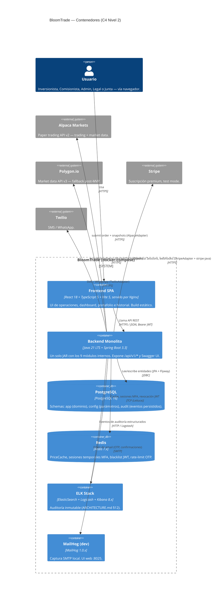

# Diagrama de Contenedores — BloomTrade (C4 Nivel 2)

**Fuente:** `ARCHITECTURE.md` §7 (infraestructura), §8 (APIs externas); `STACK.md` §1 (versiones).
**Última actualización:** 2026-05-25 — post-cierre Sprint 2.

Descompone la caja BloomTrade del [Nivel 1](c4-context.md) en sus unidades desplegables — los contenedores Docker que corren en `docker-compose.yml`. Cada contenedor es un proceso aislable con su propio runtime; las comunicaciones entre contenedores son siempre por red (JDBC, HTTP, TCP, SMTP).

---

## Diagrama

---

## Detalle de contenedores

| Contenedor | Imagen / build | Puerto interno | Expuesto en host | Volúmenes |
|---|---|---|---|---|
| `frontend` | `nginx:alpine` + build de Vite | 80 | 3000 → 80 | — |
| `backend` | Build local del JAR (multi-stage Dockerfile) | 8080 | 8080 | — |
| `postgres` | `postgres:16` | 5432 | 5432 | `pg-data` |
| `redis` | `redis:7-alpine` | 6379 | 6379 | `redis-data` |
| `elasticsearch` | `elasticsearch:8` | 9200 | 9200 | `es-data` |
| `logstash` | `logstash:8` | 5044 | — | — |
| `kibana` | `kibana:8` | 5601 | 5601 | — |
| `mailhog` | `mailhog/mailhog` | 1025 (SMTP), 8025 (UI) | 1025, 8025 | — |

> **Nota memoria del usuario:** PostgreSQL corre **nativo en :5432 fuera de Docker**. El contenedor `postgres` listado es la configuración nominal de `ARCHITECTURE.md` §7; en el entorno de desarrollo actual el backend conecta a `host.docker.internal:5432`. Este detalle es de despliegue del equipo, no de la arquitectura.

## Tácticas materializadas en este nivel

| Táctica (`ARCHITECTURE.md` §6.2) | Cómo se ve aquí |
|---|---|
| TAC-R1 — Introducir concurrencia | El backend es un único proceso multihilo (Tomcat + thread pools en TradingService / NotificationService). |
| TAC-R2 — Mantener múltiples copias de datos | Redis es contenedor separado para persistir caché entre reinicios y aislar memoria. |
| TAC-M2 — Diferir el enlace mediante configuración | Schemas `config` separado de `app` en el mismo PostgreSQL. |
| TAC-S4 — Mantener registro de auditoría | Pipeline backend → Logstash → ElasticSearch como contenedores aislados. |
| TAC-D1 — Heartbeat | MonitoringService consulta `/health` de los contenedores y APIs externas vía Spring Actuator. |

## Decisiones registradas

- **No hay load balancer ni segunda instancia del backend en MVP.** TAC-D3 (Warm Standby) queda como deuda de evolución (`ARCHITECTURE.md` §6.3 nota).
- **No hay broker de mensajes.** La comunicación entre módulos es invocación directa Java en el mismo JVM (ver `c4-component.md`).
- **MailHog vs SendGrid** son intercambiables vía `application.yml` (`spring.mail.host`); el contenedor MailHog solo aparece en `docker-compose.yml` de dev.
