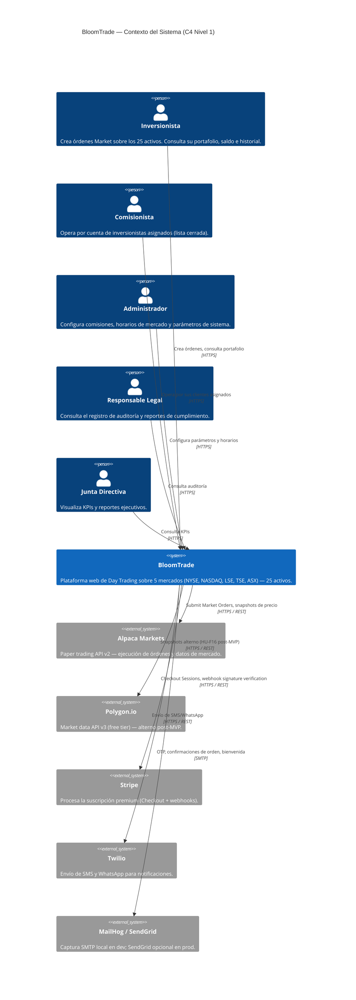

# Diagrama de Contexto — BloomTrade (C4 Nivel 1)

**Fuente:** `ARCHITECTURE.md` §1 (contexto), §8 (APIs externas), §11 (roles).
**Última actualización:** 2026-05-25 — post-cierre Sprint 2 (HU-F18+F17).

Este diagrama representa el sistema BloomTrade como una caja única, los actores humanos que lo usan y los sistemas externos con los que se integra. No muestra estructura interna — esa es competencia de los niveles 2 (Container) y 3 (Component).

---

## Diagrama

---

## Convenciones

- **Actores humanos** (`Person`) — los 5 roles definidos en `ARCHITECTURE.md` §11.
- **BloomTrade** (`System`) — caja única; su descomposición está en `c4-container.md`.
- **Sistemas externos** (`System_Ext`) — APIs y servicios SaaS consumidos vía `IntegrationService` (excepción documentada: SMTP a MailHog/SendGrid pasa por Spring Mail nativo, no por adapter custom — `ARCHITECTURE.md` §8).

## Decisiones registradas

- La distinción `MailHog (dev)` vs `SendGrid (prod opcional)` se mantiene a este nivel porque ambos exponen la misma interfaz SMTP y son intercambiables vía `application.yml` (`STACK.md` §1).
- Polygon.io aparece aunque en MVP no se invoca: el adapter está implementado contra Alpaca Market Data, y Polygon es el reemplazo previsto en ESC-M3 (`ARCHITECTURE.md` §13).
