# Diagrama de Clases — Módulo `trading` (BloomTrade Backend)

**Fuente:** `backend/src/main/java/co/edu/unbosque/bloomtrade/trading/` (HU-F09, HU-F10, HU-F15, HU-F17).
**Última actualización:** 2026-05-28 — post-cierre MVP.

Vista estructural completa del módulo `trading`: la entidad de dominio `Order` y su FSM,
los servicios de orquestación (`TradingService`, `OrderReconciliationService`), la capa REST,
los DTOs/records, los eventos de dominio con su listener post-commit, las excepciones de negocio
y el subpaquete `history` (HU-F17). Los colaboradores fuera del módulo se muestran en gris
(`«external»`) solo para dar contexto a las dependencias — no se detallan.

> **Notación:** `..>` dependencia/uso · `-->` asociación (referencia) · `*--` composición ·
> `<|..` realización (interfaz/sealed) · `<|--` herencia. Los getters de `Order` se generan vía
> Lombok `@Getter` y se omiten del diagrama por brevedad.

---

## Diagrama

```mermaid
classDiagram
    direction LR

    %% ─────────────── domain ───────────────
    namespace domain {
        class Order {
            <<entity>>
            -UUID id
            -UUID userId
            -UUID clientOrderId
            -String ticker
            -OrderSide side
            -OrderType type
            -Integer quantity
            -BigDecimal quotedUnitPrice
            -BigDecimal quotedCommission
            -BigDecimal quotedTotal
            -BigDecimal executionUnitPrice
            -BigDecimal executionTotal
            -OrderStatus status
            -String alpacaOrderId
            -String errorCode
            -String errorMessage
            -Instant submittedAt
            -Instant executedAt
            -Instant cancelRequestedAt
            -Instant canceledAt
            -Instant expiredAt
            -BigDecimal avgBuyPriceAtSubmission
            +newPending(...) Order$
            +markAsExecuted(String, BigDecimal)
            +linkToAlpaca(String)
            +markAsRejected(String, String)
            +markAsFailed(String, String)
            +markCancelRequested()
            +markAsCanceled()
            +markAsExpired()
            +linkAvgBuyPriceAtSubmission(BigDecimal)
            +isCancelable() boolean
        }
        class OrderSide {
            <<enumeration>>
            BUY
            SELL
        }
        class OrderType {
            <<enumeration>>
            MARKET
        }
        class OrderStatus {
            <<enumeration>>
            PENDING
            EXECUTED
            REJECTED
            FAILED
            CANCELED
            EXPIRED
        }
    }

    %% ─────────────── controller ───────────────
    namespace controller {
        class OrderController {
            <<RestController>>
            -TradingService tradingService
            +quote(AuthenticatedUser, QuoteRequest) ResponseEntity~QuoteResponse~
            +placeOrder(AuthenticatedUser, PlaceOrderRequest) ResponseEntity~OrderResponse~
            +cancelOrder(AuthenticatedUser, UUID) ResponseEntity~OrderResponse~
        }
    }

    %% ─────────────── service ───────────────
    namespace service {
        class TradingService {
            <<Service>>
            -OrderRepository orderRepository
            -PortfolioService portfolioService
            -UserBalanceRepository userBalanceRepository
            -MarketDataAdapter marketDataAdapter
            -AlpacaTradingAdapter alpacaTradingAdapter
            -CommissionManager commissionManager
            -MarketScheduleManager marketScheduleManager
            -UserRepository userRepository
            -ApplicationEventPublisher eventPublisher
            -OrderMapper orderMapper
            -Auditor auditor
            -OrderReconciliationService reconciliationService
            -TradingService self
            +quote(UUID, QuoteRequest) QuoteResponse
            +placeOrder(UUID, PlaceOrderRequest) PlaceOrderResult
            +placeOrderTx(UUID, PlaceOrderRequest) PlaceOrderResult
            +cancelOrder(UUID, UUID) OrderResponse
            -handleBuyTx(...) PlaceOrderResult
            -handleSellTx(...) PlaceOrderResult
            -applyCanceledTransition(...) OrderResponse
            -applyPendingCancelTransition(Order) OrderResponse
            -applyRaceFilledTransition(...) OrderResponse
            -pollUntilTerminal(AlpacaOrderResponse) AlpacaOrderResponse
        }
        class OrderReconciliationService {
            <<Service>>
            -OrderRepository orderRepository
            -AlpacaTradingAdapter alpacaTradingAdapter
            -PortfolioService portfolioService
            -ApplicationEventPublisher eventPublisher
            -TransactionTemplate transactionTemplate
            +reconcilePending(UUID) int
            +applyDriftReconcile(Order) Order
            -reconcileOne(UUID) boolean
            -applyFilledTransition(Order, AlpacaOrderResponse) boolean
            ~applyCanceledTransition(Order, AlpacaOrderResponse) boolean
            ~applyExpiredTransition(Order, AlpacaOrderResponse) boolean
            ~applyRejectedTransition(Order, AlpacaOrderResponse) boolean
        }
        class PlaceOrderResult {
            <<record>>
            +boolean isNew
            +OrderResponse response
        }
        class SubmitMarketOrderCommand {
            <<record>>
            +UUID clientOrderId
            +String ticker
            +int quantity
            +OrderSide side
            +from(Order) SubmitMarketOrderCommand$
        }
    }

    %% ─────────────── mapper ───────────────
    namespace mapper {
        class OrderMapper {
            <<Component>>
            +toResponse(Order) OrderResponse
            +toResponseWithRefund(Order, BigDecimal, Integer) OrderResponse
        }
    }

    %% ─────────────── repository ───────────────
    namespace repository {
        class OrderRepository {
            <<interface>>
            +findByClientOrderId(UUID) Optional~Order~
            +findByIdAndUserId(UUID, UUID) Optional~Order~
            +findByUserIdOrderBySubmittedAtDesc(UUID) List~Order~
            +findByUserIdAndStatusAndAlpacaOrderIdIsNotNull...(UUID, OrderStatus) List~Order~
        }
    }

    %% ─────────────── dto ───────────────
    namespace dto {
        class PlaceOrderRequest {
            <<record>>
            +UUID clientOrderId
            +String ticker
            +OrderSide side
            +OrderType type
            +Integer quantity
        }
        class QuoteRequest {
            <<record>>
            +String ticker
            +OrderSide side
            +Integer quantity
        }
        class QuoteResponse {
            <<record>>
            +String ticker
            +OrderSide side
            +int quantity
            +String estimatedUnitPrice
            +String estimatedSubtotal
            +String commission
            +String estimatedTotal
            +String currency
            +String userBalance
            +boolean sufficientFunds
            +boolean sufficientShares
            +int userShares
            +boolean marketOpen
            +Instant quotedAt
        }
        class OrderResponse {
            <<record>>
            +UUID id
            +UUID clientOrderId
            +String ticker
            +OrderSide side
            +OrderType type
            +int quantity
            +String quotedUnitPrice
            +String executionUnitPrice
            +String commission
            +String quotedTotal
            +String executionTotal
            +OrderStatus status
            +String alpacaOrderId
            +String errorCode
            +String errorMessage
            +Instant submittedAt
            +Instant executedAt
            +Instant canceledAt
            +Instant cancelRequestedAt
            +Instant expiredAt
            +String refundedAmount
            +Integer restoredQty
        }
        class CancelOutcome {
            <<sealed interface>>
        }
        class Canceled {
            <<record>>
            +Instant alpacaCanceledAt
        }
        class PendingCancel {
            <<record>>
            +String reason
        }
        class RaceFilled {
            <<record>>
            +BigDecimal filledAvgPrice
            +int filledQty
            +Instant alpacaFilledAt
        }
    }

    %% ─────────────── event ───────────────
    namespace event {
        class OrderEventListener {
            <<Component>>
            -Auditor auditor
            -Notifier notifier
            -UserRepository userRepository
            +onOrderExecuted(OrderExecutedEvent)
            +onOrderRejected(OrderRejectedEvent)
            +onOrderFailed(OrderFailedEvent)
            +onOrderQueued(OrderQueuedEvent)
            +onOrderCanceled(OrderCanceledEvent)
            +onOrderCancelPending(OrderCancelPendingEvent)
            +onOrderExpired(OrderExpiredEvent)
        }
        class OrderExecutedEvent {
            <<record>>
        }
        class OrderRejectedEvent {
            <<record>>
        }
        class OrderFailedEvent {
            <<record>>
        }
        class OrderQueuedEvent {
            <<record>>
        }
        class OrderCanceledEvent {
            <<record>>
        }
        class OrderCancelPendingEvent {
            <<record>>
        }
        class OrderExpiredEvent {
            <<record>>
        }
        class CancelSource {
            <<enumeration>>
            USER_REQUEST
            BROKER_CANCEL
            DRIFT_RECONCILE
        }
    }

    %% ─────────────── exception ───────────────
    namespace exception {
        class InvalidQuantityException {
            <<exception>>
        }
        class InvalidSideException {
            <<exception>>
            -String errorCode
            +invalidSide(String) InvalidSideException$
        }
        class InsufficientSharesException {
            <<exception>>
            -int available
            -int requested
            -String ticker
        }
        class ShortSellingNotAllowedException {
            <<exception>>
            -String ticker
            -int requestedQty
        }
        class OrderNotCancelableException {
            <<exception>>
            -UUID orderId
            -OrderStatus currentStatus
        }
        class OrderNotFoundException {
            <<exception>>
            -UUID orderId
        }
    }

    %% ─────────────── history ───────────────
    namespace history {
        class OrderHistoryController {
            <<RestController>>
            -OrderHistoryService orderHistoryService
            -OrderHistoryMapper mapper
            +list(AuthenticatedUser, Optional~String~, Optional~OrderSide~, Pageable, ...) ResponseEntity
        }
        class OrderHistoryService {
            <<Service>>
            -OrderRepository orderRepository
            -OrderReconciliationService reconciliationService
            +list(UUID, Optional~String~, Optional~OrderSide~, Pageable) Page~Order~
        }
        class OrderHistoryMapper {
            <<Component>>
            +toOrderHistoryDto(Order) OrderHistoryDto
            +toPaginationDto(Page) PaginationDto
            +toOrderHistoryResponse(Page~Order~) OrderHistoryResponse
        }
        class OrderSpecifications {
            <<utility>>
            +byUser(UUID) Specification~Order~$
            +byTicker(String) Specification~Order~$
            +bySide(OrderSide) Specification~Order~$
        }
        class OrderHistoryDto {
            <<record>>
        }
        class OrderHistoryResponse {
            <<record>>
            +List~OrderHistoryDto~ content
            +PaginationDto pagination
        }
        class PaginationDto {
            <<record>>
            +int page
            +int size
            +long totalElements
            +int totalPages
        }
    }

    %% ─────────────── external (contexto) ───────────────
    namespace external {
        class AlpacaTradingAdapter {
            <<external>>
        }
        class MarketDataAdapter {
            <<external>>
        }
        class PortfolioService {
            <<external>>
        }
        class JpaRepository {
            <<external>>
        }
        class RuntimeException {
            <<external>>
        }
    }

    %% ═══════════════ relaciones ═══════════════

    %% Dominio: Order y sus enums
    Order --> OrderSide
    Order --> OrderType
    Order --> OrderStatus

    %% Capa REST → servicio
    OrderController ..> TradingService : uses
    OrderHistoryController ..> OrderHistoryService : uses
    OrderHistoryController ..> OrderHistoryMapper : uses

    %% TradingService: colaboradores internos
    TradingService --> OrderRepository
    TradingService --> OrderMapper
    TradingService --> OrderReconciliationService
    TradingService ..> Order : crea / muta
    TradingService ..> PlaceOrderResult : retorna
    TradingService ..> SubmitMarketOrderCommand : construye
    TradingService ..> CancelOutcome : consume
    TradingService ..> AlpacaTradingAdapter
    TradingService ..> MarketDataAdapter
    TradingService ..> PortfolioService

    %% TradingService publica eventos
    TradingService ..> OrderExecutedEvent : publish
    TradingService ..> OrderRejectedEvent : publish
    TradingService ..> OrderFailedEvent : publish
    TradingService ..> OrderQueuedEvent : publish
    TradingService ..> OrderCanceledEvent : publish
    TradingService ..> OrderCancelPendingEvent : publish

    %% Reconciliación
    OrderReconciliationService --> OrderRepository
    OrderReconciliationService ..> Order : muta
    OrderReconciliationService ..> AlpacaTradingAdapter
    OrderReconciliationService ..> PortfolioService
    OrderReconciliationService ..> OrderCanceledEvent : publish
    OrderReconciliationService ..> OrderExpiredEvent : publish
    OrderReconciliationService ..> OrderRejectedEvent : publish

    %% Mapper
    OrderMapper ..> Order
    OrderMapper ..> OrderResponse

    %% Repository
    JpaRepository <|-- OrderRepository
    OrderRepository ..> Order

    %% Listener escucha eventos
    OrderEventListener ..> OrderExecutedEvent : listens
    OrderEventListener ..> OrderRejectedEvent : listens
    OrderEventListener ..> OrderFailedEvent : listens
    OrderEventListener ..> OrderQueuedEvent : listens
    OrderEventListener ..> OrderCanceledEvent : listens
    OrderEventListener ..> OrderCancelPendingEvent : listens
    OrderEventListener ..> OrderExpiredEvent : listens

    %% CancelOutcome sealed
    CancelOutcome <|.. Canceled
    CancelOutcome <|.. PendingCancel
    CancelOutcome <|.. RaceFilled

    %% Evento con enum anidado
    OrderCanceledEvent *-- CancelSource

    %% SubmitMarketOrderCommand se deriva de Order
    SubmitMarketOrderCommand ..> Order : from()

    %% Excepciones
    RuntimeException <|-- InvalidQuantityException
    RuntimeException <|-- InvalidSideException
    RuntimeException <|-- InsufficientSharesException
    RuntimeException <|-- ShortSellingNotAllowedException
    RuntimeException <|-- OrderNotCancelableException
    RuntimeException <|-- OrderNotFoundException
    OrderNotCancelableException ..> OrderStatus

    %% History
    OrderHistoryService --> OrderRepository
    OrderHistoryService --> OrderReconciliationService
    OrderHistoryService ..> OrderSpecifications
    OrderHistoryMapper ..> Order
    OrderHistoryMapper ..> OrderHistoryDto
    OrderHistoryMapper ..> OrderHistoryResponse
    OrderHistoryResponse *-- OrderHistoryDto
    OrderHistoryResponse *-- PaginationDto
    OrderSpecifications ..> Order
```



---

## Lectura rápida

- **Núcleo de dominio:** `Order` es el agregado raíz. Se construye solo vía la factory
  `newPending(...)` (status inicial `PENDING`) y solo transiciona a estados terminales vía sus
  métodos `markAs*` — encapsulación de la FSM definida por `OrderStatus` (HU-F09 D16, HU-F15 D3).
- **Orquestación:** `TradingService` concentra `quote` / `placeOrder` (con dispatch interno
  BUY/SELL) / `cancelOrder`. Publica eventos de dominio que `OrderEventListener` procesa
  **post-commit** (`@TransactionalEventListener`) para email + auditoría sin bloquear la tx.
- **Reconciliación:** `OrderReconciliationService` materializa fills/cancel/expired/rejected de
  órdenes encoladas en Alpaca (reconcile lazy v2), invocado desde el historial y desde el path
  de drift de `cancelOrder`.
- **`CancelOutcome`** es un *sealed interface* con tres resultados posibles del polling de
  cancelación: `Canceled`, `PendingCancel`, `RaceFilled`.
- **Subpaquete `history` (HU-F17):** lectura paginada con filtros dinámicos vía
  `JpaSpecificationExecutor` + `OrderSpecifications`.
```
