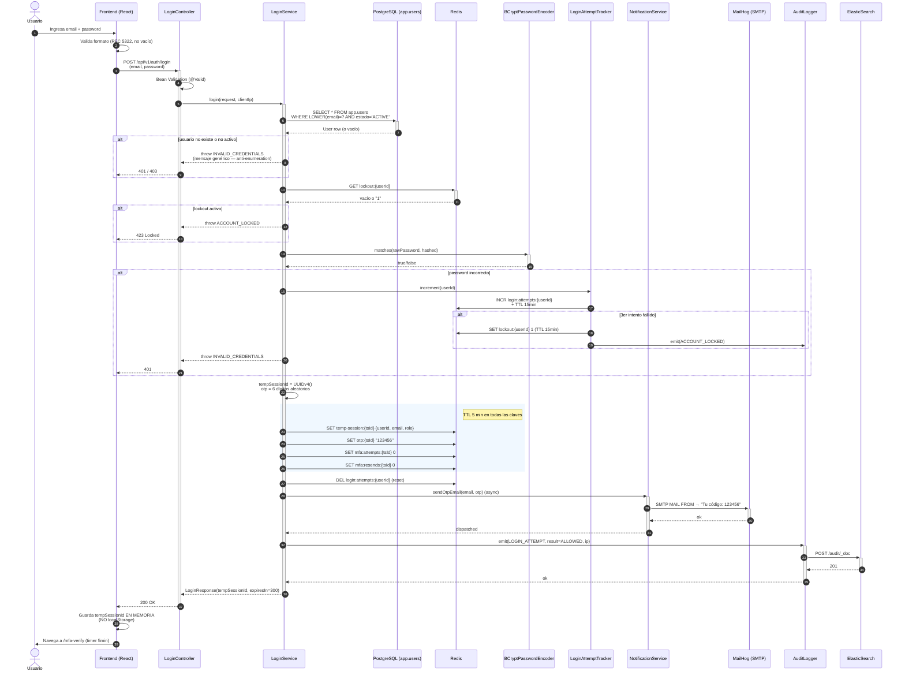
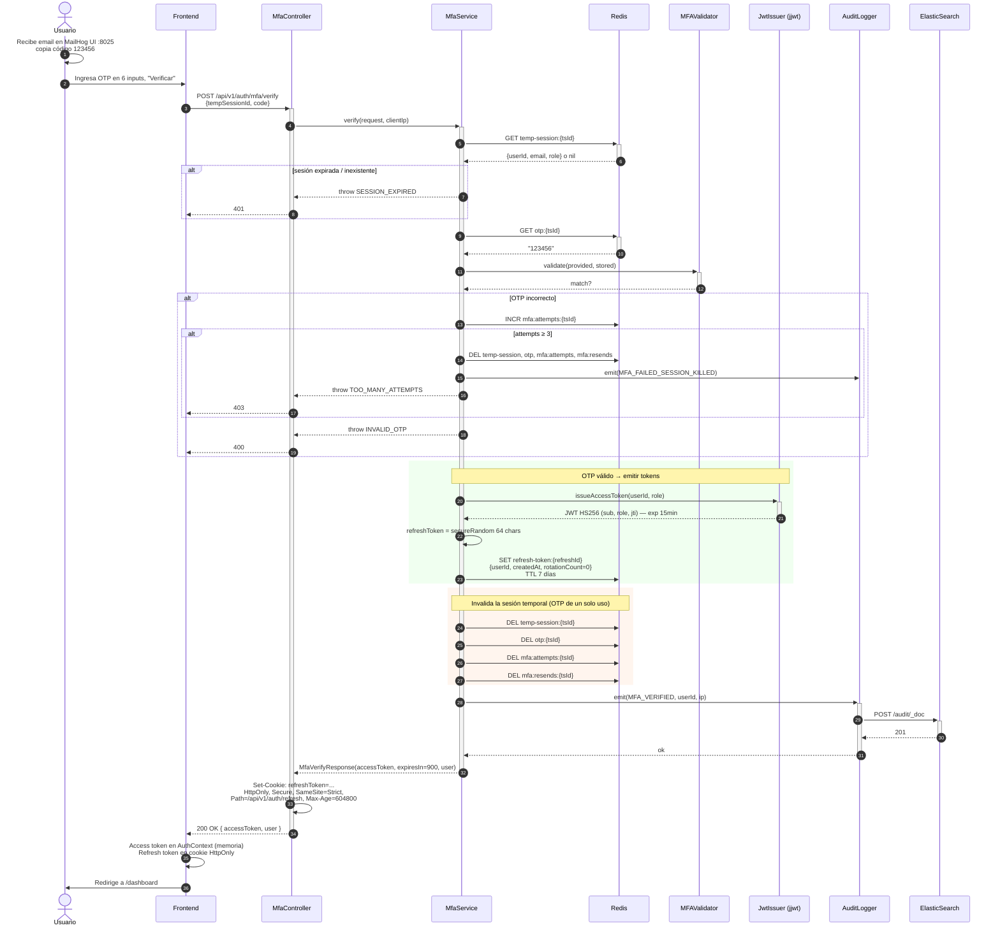

# Diagrama de Secuencia — Login + MFA (HU-F02 / HU-F03)

**Fuente:** `specs/HU-F02-F03-login-mfa/SPEC.md` §5.1.
**Última actualización:** 2026-05-25.

Representa el flujo de autenticación de dos pasos: (1) login con email+password que dispara el envío de un OTP por email, y (2) verificación del OTP que emite el access token JWT y la cookie de refresh. Implementa **TAC-S1 — Autenticar actores** (`ARCHITECTURE.md` §6).

---

## Fase 1 — Login (credenciales → OTP enviado)

---

## Fase 2 — Verificación de OTP → emisión de JWT

---

## Decisiones registradas (extracto de SPEC §5.1 / §6)

- **Anti-enumeration.** El error "email no existe" y "password incorrecto" responden ambos con `401 INVALID_CREDENTIALS` mensaje genérico. **Nunca** se filtra cuál de los dos falló.
- **`tempSessionId` en memoria, no en localStorage.** Es un identificador opaco con TTL 5min; si el usuario refresca la página pierde la sesión temporal (comportamiento aceptado — equivalente a volver a login).
- **OTP de un solo uso.** Tras verificación exitosa, las 4 claves de Redis (`temp-session`, `otp`, `mfa:attempts`, `mfa:resends`) se borran. No se puede re-usar el mismo OTP ni mismo `tempSessionId`.
- **Lockout por intentos.** 3 intentos fallidos → cuenta bloqueada 15min en Redis (`lockout:{userId}`). El contador `login:attempts:{userId}` también vive en Redis con TTL 15min. Implementa **ESC-S1** (`ARCHITECTURE.md` §13).
- **Refresh token rotativo.** Cada llamada a `/auth/refresh` rota el token (DELETE viejo, SET nuevo con `rotationCount+1`). El refresh token vive solo en cookie HttpOnly (nunca en JS).

## Tácticas materializadas

| Táctica | Componente | Dónde se ve aquí |
|---|---|---|
| TAC-S1 — Autenticar actores | `MFAValidator`, `MfaService` | Fase 2, validación del OTP |
| TAC-S3 — Revocar acceso | `LoginAttemptTracker` | Fase 1, lockout tras 3 intentos |
| TAC-S4 — Mantener registro | `AuditLogger` | Eventos `LOGIN_ATTEMPT`, `MFA_VERIFIED`, `ACCOUNT_LOCKED`, `MFA_FAILED_SESSION_KILLED` |
| TAC-M1 — Intermediario | `NotificationService` → `JavaMailSender` → MailHog | Fase 1, envío del OTP por SMTP |

## Flujos no representados aquí

- **Refresh de access token** (SPEC §5.2.1): `POST /auth/refresh` con cookie → nuevo JWT + rotación.
- **Logout** (SPEC §5.2.2): `POST /auth/logout` → blacklist del `jti` en Redis + DELETE refresh token + Set-Cookie expirada.
- **Reenvío de OTP** (SPEC §5.2.3): `POST /auth/mfa/resend` con cooldown 30s y máximo 3 reenvíos por sesión.
- **Errores 4xx/5xx** (SPEC §5.3): credenciales inválidas, cuenta bloqueada, OTP expirado, demasiados intentos en MFA.
