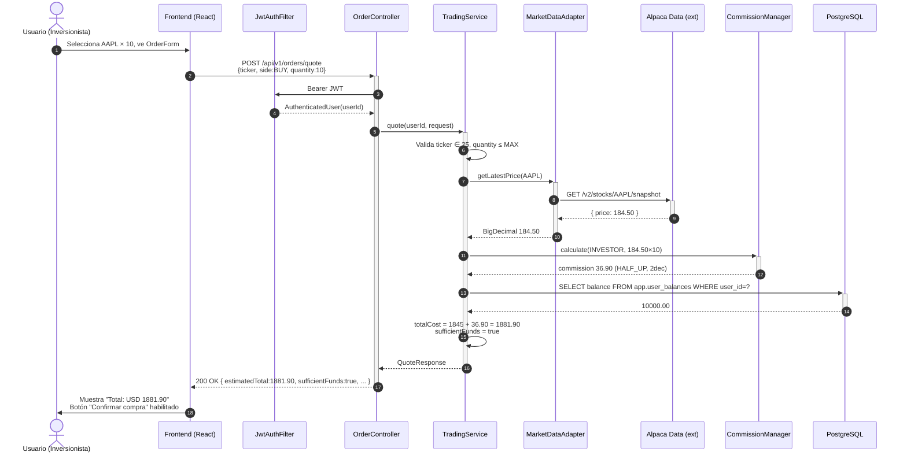
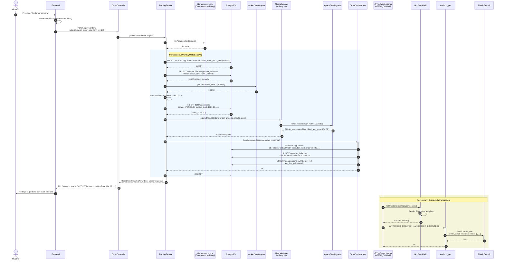

# Diagrama de Secuencia — Orden de Compra Market (HU-F09)

**Fuente:** `specs/HU-F09-orden-compra-market/SPEC.md` §5.1 (flujo principal).
**Última actualización:** 2026-05-25.

Representa el flujo end-to-end de una orden de compra Market exitosa: desde que el usuario abre `/trade` hasta que el portafolio queda actualizado y la confirmación llega al frontend. Cubre las dos llamadas HTTP (`POST /quote` informativo y `POST /orders` transaccional) y la cadena post-commit (notificación + auditoría).

---

## Fase 1 — Quote informativo (sin persistencia)

> El quote **no** persiste, **no** llama a Alpaca Trading, **no** toma locks. Solo lee precio + balance y calcula. Es seguro repetirlo N veces sin efectos.

---

## Fase 2 — Confirmación, ejecución y cadena post-commit

---

## Notas sobre el modelo

- **Idempotencia.** El `clientOrderId` lo genera el frontend (`crypto.randomUUID()`) y el backend lo persiste como columna única en `app.orders`. Doble-click → la segunda llamada encuentra la fila ya creada y responde `200 OK` con la misma orden — **no llama a Alpaca otra vez**, no descuenta saldo. (SPEC §5.2.3.)
- **Lock pessimistic.** El `SELECT ... FOR UPDATE` sobre `user_balances` evita race conditions con compras simultáneas del mismo usuario.
- **Resilience4j.** El `AlpacaAdapter` envuelve el call HTTP con `@Retry(name="alpacaApi")` — 3 intentos a 1s/3s/5s. Si los 3 fallan, sale `502 ALPACA_UNAVAILABLE` y la transacción hace rollback (TAC-D2, `ARCHITECTURE.md` §6.3).
- **Cadena post-commit.** `OrderOrchestrator` confirma la transacción y luego un `@TransactionalEventListener(AFTER_COMMIT)` dispara notificación + auditoría. Si una de las dos falla, **la orden ya está commitada** — la deuda de reconciliación queda como evento manual (memoria del usuario: D27 F09 + D18 F10 — `noRollbackFor` aplicado a métodos `@Transactional` anidados).
- **ESC-I1.** El SLO "confirmación + portafolio actualizado + notificación en <5s" se cumple porque la transacción JPA principal corre síncrona, típicamente <500ms total (SPEC §13).

## Flujos no representados aquí

- **`accepted` no terminal** (D29 F09 — orden encolada en Alpaca sin filled inmediato): se persiste con `status=PENDING`, sin débito de saldo, sin upsert de posición. Reconciliación pendiente (deuda viva).
- **Idempotencia duplicada en concurrencia real**: el `IdempotencyLock` en memoria (`ConcurrentHashMap`) evita dos hits paralelos del mismo `clientOrderId`. Sirve para una sola instancia del backend; con N instancias, habría que mover el lock a Redis (deuda post-MVP).
- **Errores 4xx/5xx**: ver SPEC §5.3 — saldo insuficiente (409), ticker inválido (400), Alpaca rechaza (422), retries agotados (502).
