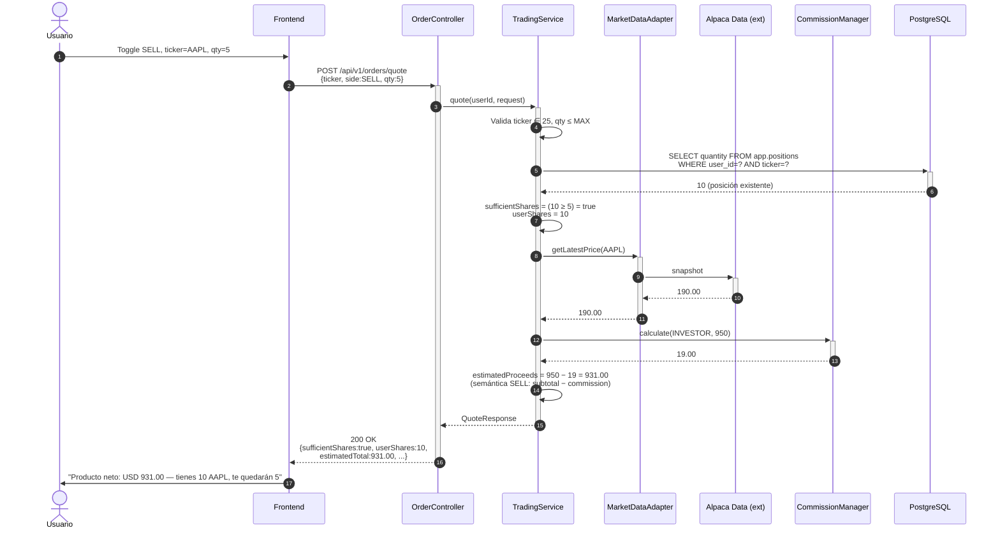
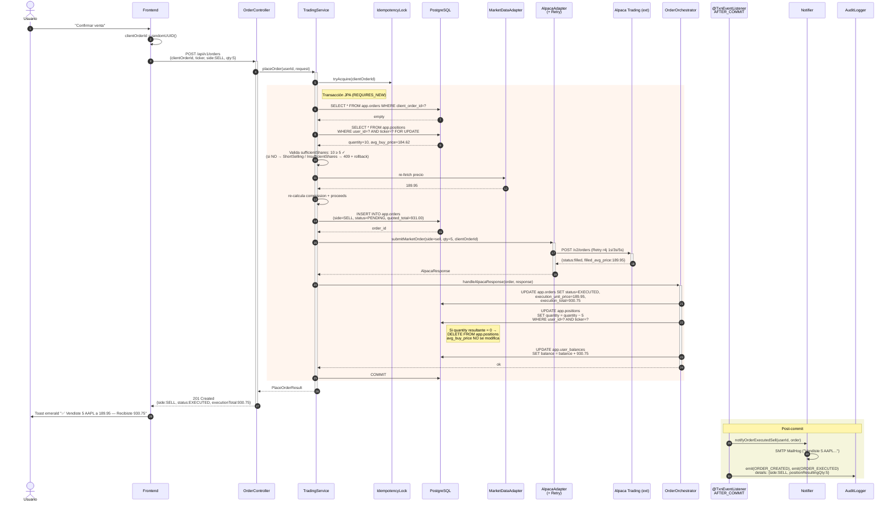

# Diagrama de Secuencia — Orden de Venta Market (HU-F10)

**Fuente:** `specs/HU-F10-orden-venta-market/SPEC.md` §5.1.
**Última actualización:** 2026-05-25.

Variación de [la orden de compra (F09)](sequence-orden-compra-market.md). El esqueleto del flujo es idéntico (mismo `OrderController`, misma transacción JPA, mismo `OrderOrchestrator`, misma cadena post-commit). Las diferencias clave están en:

1. La **validación de posición** reemplaza la validación de fondos como bloqueante.
2. El balance se **acredita** (no se descuenta); la posición se **decrementa** (no se incrementa).
3. La semántica de `estimatedTotal` cambia: en BUY es `subtotal + commission` (descuento), en SELL es `subtotal − commission` (producto neto).

Este documento muestra solo el flujo `SELL`; para todo lo común consultar F09.

---

## Fase 1 — Quote SELL informativo

> Si el usuario no tiene posición o tiene menos cantidad de la requerida, el quote responde 200 con `sufficientShares=false` (NO 4xx — el quote es informativo, igual que `sufficientFunds=false` en F09 §5.2.1). El frontend deshabilita "Confirmar venta".

---

## Fase 2 — Confirmación + ejecución + cadena post-commit

---

## Diferencias contra F09 (BUY) — tabla resumen

| Aspecto | BUY (F09) | SELL (F10) |
|---|---|---|
| Validación bloqueante | `balance ≥ totalCost` (fondos) | `position.quantity ≥ sellQuantity` (acciones) |
| Lock pessimistic | `user_balances FOR UPDATE` | `positions FOR UPDATE` (+ balance al actualizar) |
| Excepción específica de SELL | — | `ShortSellingNotAllowedException`, `InsufficientSharesException` (ambas → 409) |
| Efecto sobre balance | `balance −= execution_total` | `balance += execution_total` |
| Efecto sobre posición | UPSERT (`qty +=`, recalcula `avg_buy_price`) | `qty −=`. Si `qty=0` → DELETE. `avg_buy_price` **NO** se modifica. |
| Semántica `estimatedTotal` | `subtotal + commission` (descuento) | `subtotal − commission` (producto neto) |
| Email post-commit | "Tu orden de compra de 10 AAPL se ejecutó a USD 184.62" | "Vendiste 5 AAPL a USD 189.95. Producto neto: USD 930.75" |

## Decisiones registradas (extracto de SPEC §5.1)

- **`avg_buy_price` no se modifica en venta.** Mientras quede tenencia, refleja el precio promedio histórico de compra — base para que HU-F16 calcule ganancia/pérdida.
- **`accepted` no terminal en SELL (D-SELL-QUEUED-RISK heredado D29 F09).** Si Alpaca encola la orden, la posición se decrementa optimistamente pero el balance NO se acredita aún. Si Alpaca luego cancela, el usuario perdió posición sin recibir crédito. MVP no mitiga; deuda registrada.
- **Memoria del usuario — `noRollbackFor` en nested @Transactional (D27 F09 + D18 F10):** la `ShortSellingNotAllowedException` se marca con `noRollbackFor` en el método interno para que el handler global responda 409 en vez de 500 `UnexpectedRollbackException`. Aplicar siempre que un `@Transactional` anidado lance excepción de dominio.

## Flujos no representados aquí

- Idempotencia por `clientOrderId` (igual que F09; ver SPEC F09 §5.2.3).
- Errores 4xx/5xx (SPEC §5.3): `SHORT_SELLING_NOT_ALLOWED` (409), `INSUFFICIENT_SHARES` (409), Alpaca rejected (422), retries agotados (502).
- Path `accepted` no terminal — ver decisión D-SELL-QUEUED-RISK arriba.
